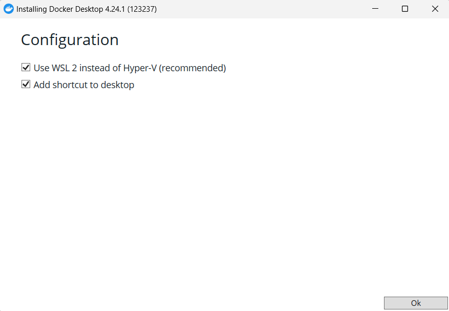
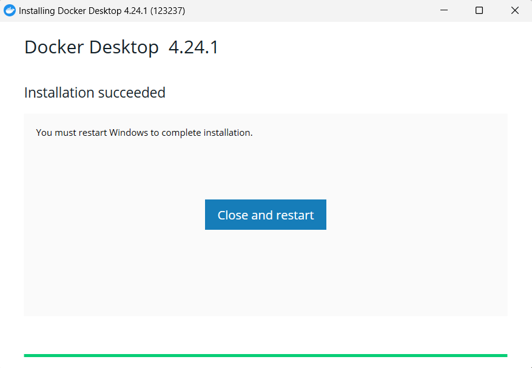
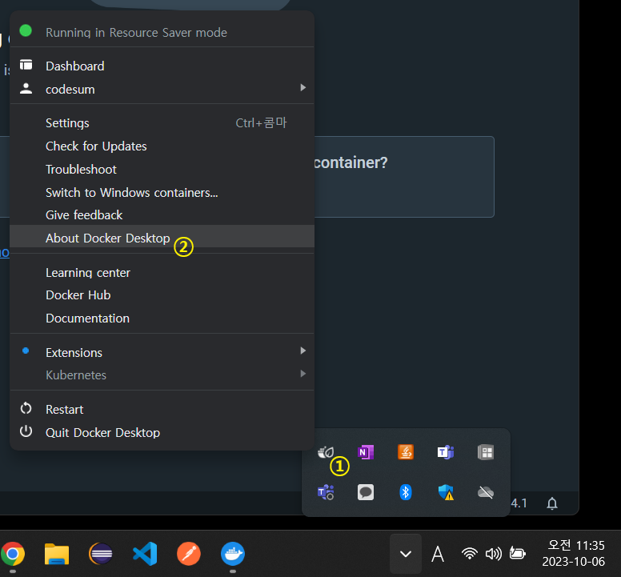
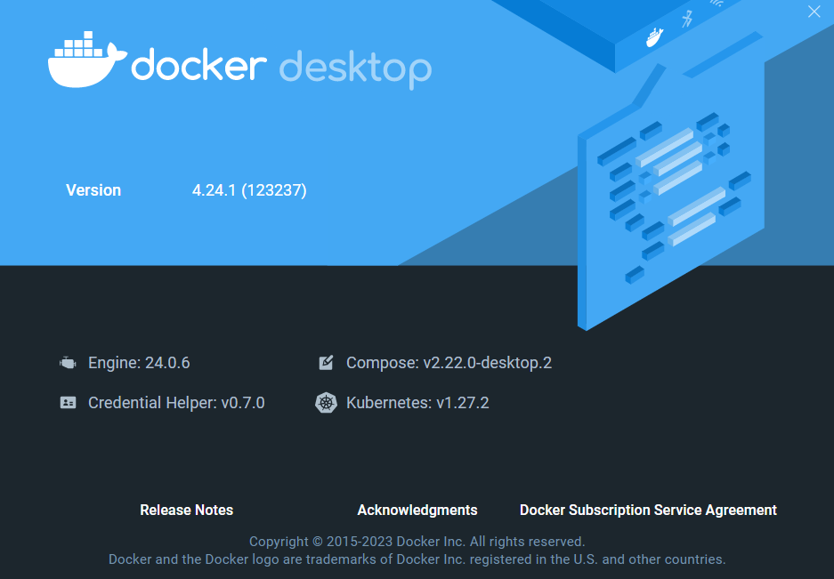
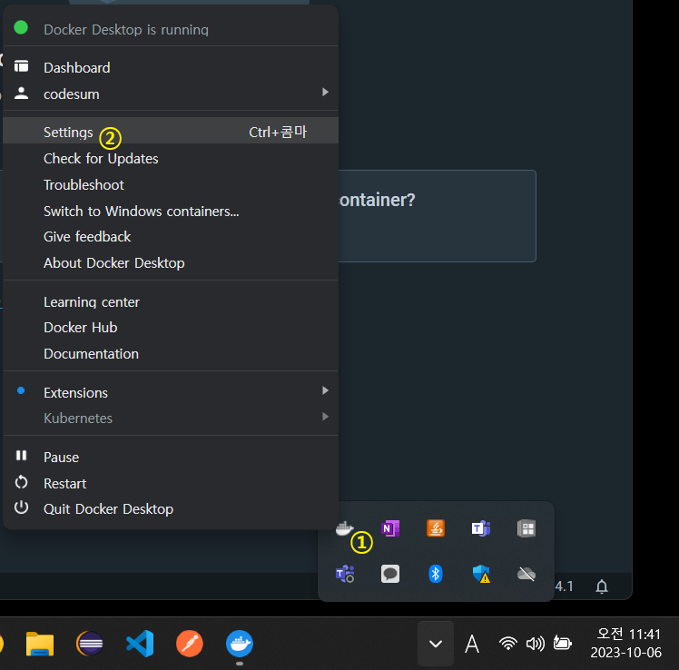
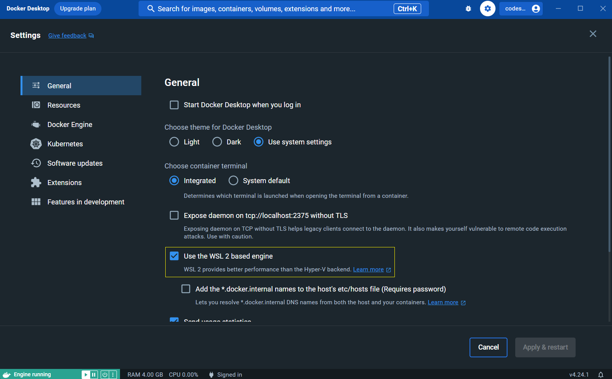
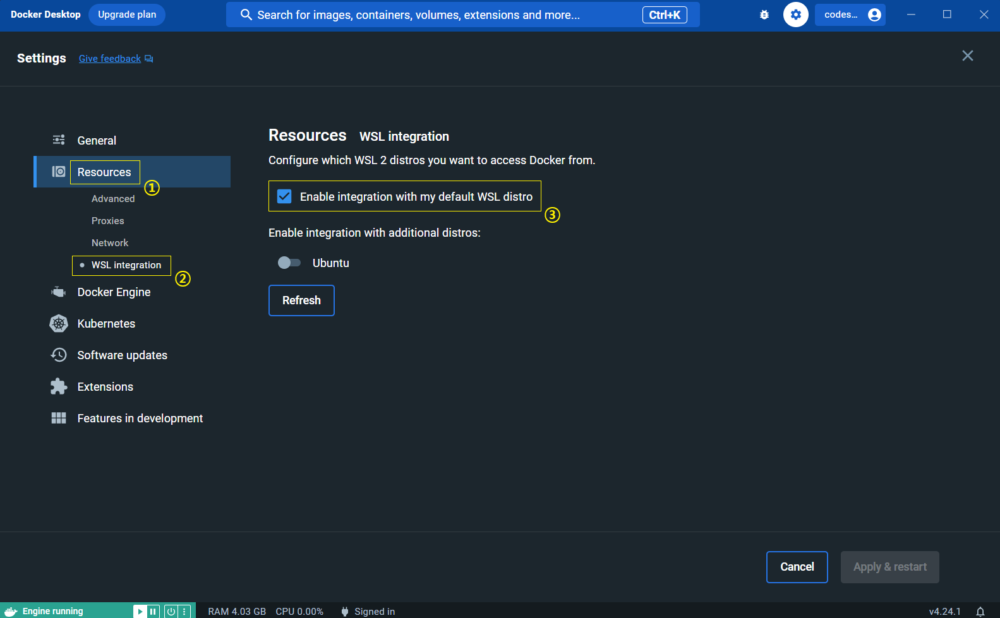

# ✅ Docker Desktop 설치 및 실행

> 목표 : Windows OS 에 Docker Desktop 설치 및 실행


### 1. WSL2 세팅하기

- 현재 Windows 에 설치된 리눅스 버전이 WSL 인지, WSL2 인지 확인

  ```powershell
  wsl --list --verbose
  ```

- WSL 버전 기본값이 2가 아닌 다른 상태라면, 아래 명령어 실행해서 2 로 변경

  ```powershell
  wsl --set-default-version 2
  ```


### 2. Docker Desktop 설치

- [다운로드 사이트](https://www.docker.com/products/docker-desktop/)에서 [Download for Windows] 클릭

- 다운로드 받은 `Docker Desktop Installer.exe` 파일 실행

- 설치 중간에 Configuration 창 뜨면, 둘 다 체크하고 설치 진행

  

  

  - 1번째 옵션은 WSL 관련
  - 2번째 옵션은 바탕화면에 아이콘 추가할지 여부

- 설치 완료되면 Installation succeeded 메세지 뜸

  

  - 시스템 상태에 따라 재시작이나 로그아웃 해야 하는 경우도 있음


### 3. Docker Desktop 에 WSL2 관련 설정 잡기

- 시스템에 WSL2가 활성화되어있다면 Docker는 기본적으로 WSL2를 백엔드로 Docker Engine을 실행

- 고래 모양 아이콘에서 마우스 오른쪽 버튼을 누르면 Docker Desktop 상태를 관리할 수 있음. 여기서 [About Docker Desktop] 클릭

  

  

- WSL2 설정이 잘 되어있는지 확인하고 WSL 통합 설정 진행

  - Docker 아이콘에서 마우스 오른쪽 버튼 클릭한 다음, [Settings] 클릭

    

  - General 설정에서 ’Use the WSL 2 based engine’에 체크가 되어있는지 확인. 체크가 되어있지 않다면 체크하고 오른쪽 아래의 [Apply & Restart] 버튼 클릭

    

  - Resource > WSL Integration 메뉴로 이동. ’Enable Integration with my default WSL distro’에 체크되어 있는지 확인. 체크가 되어있지 않으면, 체크하고 오른쪽 아래의 [Apply & Restart] 버튼을 클릭하여 도커 엔진 재실행

    

  - 여기까지 작업하면 WSL2 기반 Docker 설치 모두 완료!


### 4. Docker Desktop 실행

- Docker 클라이언트 정보, 서버 정보 확인

  ```powershell
  docker version
  ```

  - 명령 프롬프트
  - Ubuntu
