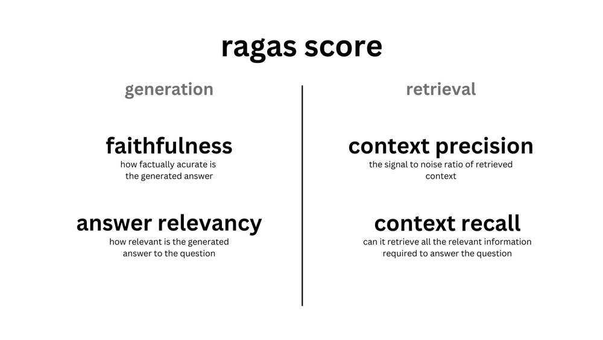

# ✅ Ragas

> **[참고자료]**
>
> - Ragas 공식문서 [(link)](https://docs.ragas.io/en/latest/)
> - Ragas Github [(link)](https://github.com/explodinggradients/ragas)
> - LangChain "RAG Evaluation" Webinar [(link)](https://www.youtube.com/watch?v=fWC4VxolWAk) (23.08.25)
> - [LangChain Blog] [Evaluating RAG pipelines with Ragas + LangSmith](https://blog.langchain.dev/evaluating-rag-pipelines-with-ragas-langsmith/) (23.08.23)
> - [Medium] [RAG Evaluation](https://cobusgreyling.medium.com/rag-evaluation-9813a931b3d4) (23.09.01)
> - [Medium] [Combining Ragas (RAG Assessment Tool) with LangSmith](https://cobusgreyling.medium.com/combining-ragas-rag-assessment-tool-with-langsmith-e46078001f95) (23.09.06)


- Ragas
  - *"Evaluation framework for your Retrieval Augmented Generation (RAG) pipelines."*
  - 평가, 모니터링 기능을 제공하여 프로덕션 단계의 LLM & RAG application 성능을 높임


- Ragas 의 평가 대상

  > 아래 2가지 컴포넌트는 평가 프로세스를 나누는 카테고리기도 하며, QA pipeline 을 평가하기 위해선 2가지 컴포넌트 모두를 평가 대상으로 삼아야 함

  1. 검색기(Retriever) : 입력된 질문에 답변하는데 있어 가장 연관성 있는 정보를 검색
  2. 생성기(Generator) : 검색된 정보를 바탕으로 답변을 생성


- Ragas Score

  > 아래 4가지 항목의 조화 평균(harmonic mean) 계산

  

  - 생성(generation) 성능을 평가하는 지표
    - `faithfulness` : 답변의 정확도. 생성된 답변에 환각현상(hallucinations)이 얼마나 있는지(=혹은 생성된 답변이 얼마나 정확한지) 측정
    - `answer_relevancy` : 질문과의 연관도. 생성된 답변이 질문 내용과 얼마나 연관성이 높은지 측정
  - 검색(retrieval) 성능을 평가하는 지표
    💡 [Machine Learning] precision vs. recall 개념 구분 [(link)](https://sumniya.tistory.com/26)
    - `context_precision` : context 내부 chunks 들이 ground_truth(=사실이라고 정의된 것들)에 얼마나 부합하는지를 계산
      - (ML 에서 precision 은 모델이 True라고 분류한 것 중에서 실제 True인 것의 비율)
    - `context_recall` : 질문에 답변하는 과정에서 ‘필요한 모든 필수 정보’를 ‘검색기’가 검색할 수 있는지를 계산
      - (ML 에서 recall 은 실제 True인 것 중에서 모델이 True라고 예측한 것의 비율)


- Ragas 활용 예시

  1. `pip install ragas`

  2. 평가를 위한 Chain 만들기

  3. `from ragas.metrics` 에서 평가에 필요한 모든 항목 import 

  4. `from ragas.langchain` 에서 `RagasEvaluatorChain` import

     - ragas 평가 항목을 LangChain [EvaluationChain](https://python.langchain.com/docs/guides/evaluation/?ref=blog.langchain.dev) 으로 변환시켜 주는 체인

     ```python
     from ragas.metrics import faithfulness, answer_relevancy, context_precision, context_recall
     from ragas.langchain import RagasEvaluatorChain
     
     # make eval chains
     eval_chains = {
         m.name: RagasEvaluatorChain(metric=m) 
         for m in [faithfulness, answer_relevancy, context_precision, context_recall]
     }
     ```

  5. 위 코드로 평가용 체인이 만들어지면, 아래 코드를 작성하여 평가용 체인을 호출

     ```python
     # evaluate
     for name, eval_chain in eval_chains.items():
         score_name = f"{name}_score"
         print(f"{score_name}: {eval_chain(result)[score_name]}")
     
     # 평가용 체인 호출은 __call__() 메서드 활용
     
     # output
     # faithfulness_score: 1.0
     # answer_relevancy_score: 0.9193459596511587
     # context_precision_score: 0.07480974380786602
     # context_recall_score: 0.9193459596511587
     ```

     

